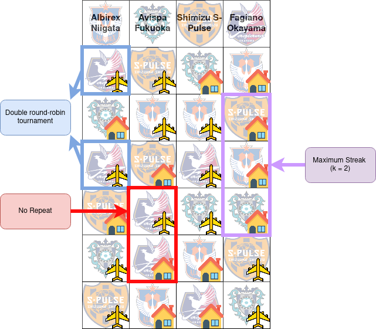

# Feasible and Infeasible Initialization in Estimation of Distribution Algorithms for the Traveling Tournament Problem

This repository contains the code and materials for our paper.

## Abstract

In constrained optimization, the way an algorithm is initialized can impact its behavior. In Estimation of Distribution Algorithms (EDAs), using fully feasible, partially feasible, or infeasible initial solutions affects both diversity and convergence. In this work, we analyzed this effect on the Traveling Tournament Problem (TTP) via computational experiments on NL benchmark instances evaluating overall performance, constraint violations, and population diversity. Our results show that starting from fully feasible solutions often limits exploration and leads to early convergence, in contrast, infeasible or partially feasible solutions allow the algorithm to explore the search space more, while local search is then needed to recover feasibility. Local search not only repairs solutions but can also introduce new diversity in the population, helping the loss of entropy during convergence. Initialization strongly affects EDA performance and shapes the function of local search, particularly in highly constrained problems.

___

## Problem Overview

The Traveling Tournament Problem (TTP) schedules a double round-robin tournament for an even number of teams, where each team plays every other team twice (home and away), while respecting the following constraints:

1. Maximum Streak (maxStreak) – No team plays more than n consecutive home or away games.
2. No Repeats (noRepeat) – Teams cannot face the same opponent in consecutive rounds.
3. Double Round-Robin (doubleRoundRobin) – Each team plays only one game per round.

<div align="center">
<b>Example:</b><br>
<br>
<i>Figure 1:</i> An example of a valid TTP instance. The rows indicate slots, while the columns indicate the matches of each team. The airplane/house icon indicates an "away" or "home" game, respectively. Here, we consider k = 2 for the maxStreak constraint.
</div>

---

## Features
- C++ (C++20) implementation
- Standard EDA and EDA-Tree
- Integration with GHOST framework
- Multiple initialization strategies:
    * Random
    * Circle method
    * Alternating circle method
- Experimental evaluation on NL benchmark instances

---

## Build & Run

### Prerequisites:
- g++ with C++20 support
- make
- Unix-like environment
- GHOST library

### Running:

    ./run.sh

### Configuration

All experiment parameters can be modified in the `test_all.sh` script.

Example configuration:

```bash
FILE="instances/NL12.txt"
PENALIZATION_VALUE=10000
CORES=1

ELITE=0.5
SURVIVOR=0.75
MAX_GEN=500
N_POP=1000
TIMEOUT_LS=5000000
LOCAL_SEARCH=true
PENALIZATION=true
NUM_RUNS=30
SEED=2026
LS_PROBABILITY=0.1
```

---

## License

This project is distributed under the [LICENSE](LICENSE). See the LICENSE file for details.